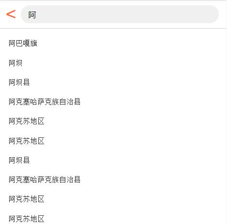

# 说明（vue仿大众点评）

## 大致描述

vue实现：vue-cli 、vue-router、vuex

存储：Bmob

接口：EasyMock仿造接口

## 实现功能

注册、手机验证登陆、账号密码登录、密码修改、首页数据请求展示、城市数据请求展示、选择、搜索

### 实现效果

### 1.用户登录界面（数据存储为云存储，短信验证使用Bmob的短信功能）

### 2.首页（图标区、点评头条自动轮播、推荐）

#### 2.1 	图标区（根据返回的数据自动分页显示，每页十个数据）

#### 2.2 	点评头条、超值推荐（vue-awesome-swiper自动轮播）

#### 2.3	 猜你喜欢（尚未实现商品详情页）

### 3.城市

#### 3.1 	热门城市

#### 3.2	根据城市列表（根据首字母实现跳转）

#### 3.3 城市名搜索效果

